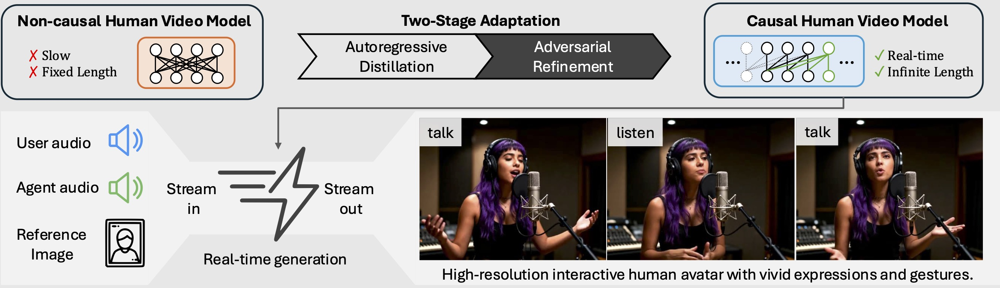

  <h1 align="center">StreamAvatar: Streaming Diffusion Models for Real-Time Interactive Human Avatars</h1>

  

    <a href="https://github.com/RainEggplant">Zhiyao Sun</a>
    ·
    <a href="https://ziqiaopeng.github.io/">Ziqiao Peng</a>
    ·
    Yifeng Ma
    ·
    Yi Chen
    ·
    Zhengguang Zhou
    ·
    Zixiang Zhou
     
    Guozhen Zhang
    ·
    Youliang Zhang
    ·
    Yuan Zhou
    ·
    Qinglin Lu
    ·
    <a href="https://yongjinliu.github.io/">Yong-Jin Liu</a>
      
    
  

## Abstract

Real-time, streaming interactive avatars represent a critical yet challenging goal in digital human research. Although diffusion-based human avatar generation methods achieve remarkable success, their non-causal architecture and high computational costs make them unsuitable for streaming. Moreover, existing interactive approaches are typically limited to head-and-shoulder region, limiting their ability to produce gestures and body motions. To address these challenges, we propose a two-stage autoregressive adaptation and acceleration framework that applies autoregressive distillation and adversarial refinement to adapt a high-fidelity human video diffusion model for real-time, interactive streaming. To ensure long-term stability and consistency, we introduce three key components: a Reference Sink, a Reference-Anchored Positional Re-encoding (RAPR) strategy, and a Consistency-Aware Discriminator. Building on this framework, we develop a one-shot, interactive, human avatar model capable of generating both natural talking and listening behaviors with coherent gestures. Extensive experiments demonstrate that our method achieves state-of-the-art performance, surpassing existing approaches in generation quality, real-time efficiency, and interaction naturalness.
